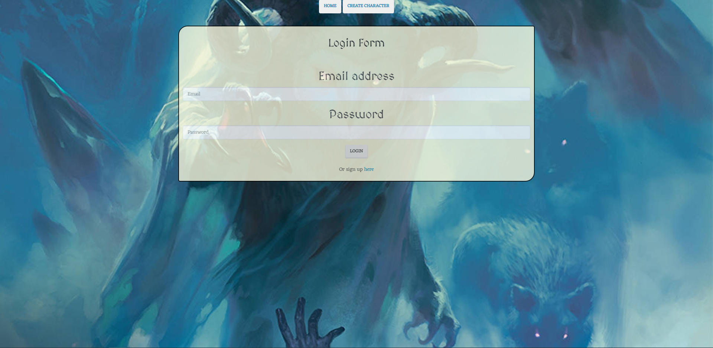
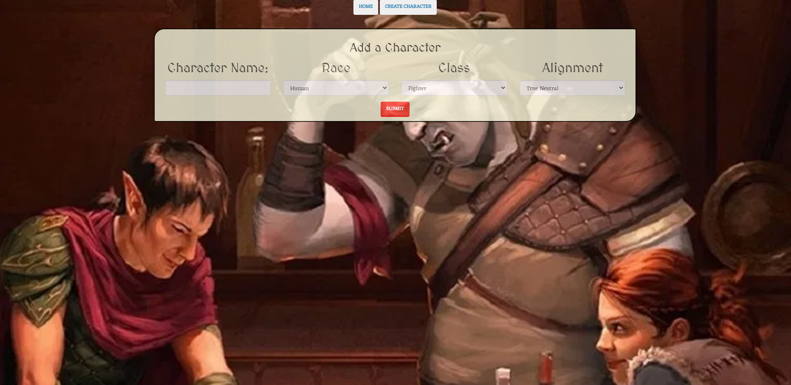
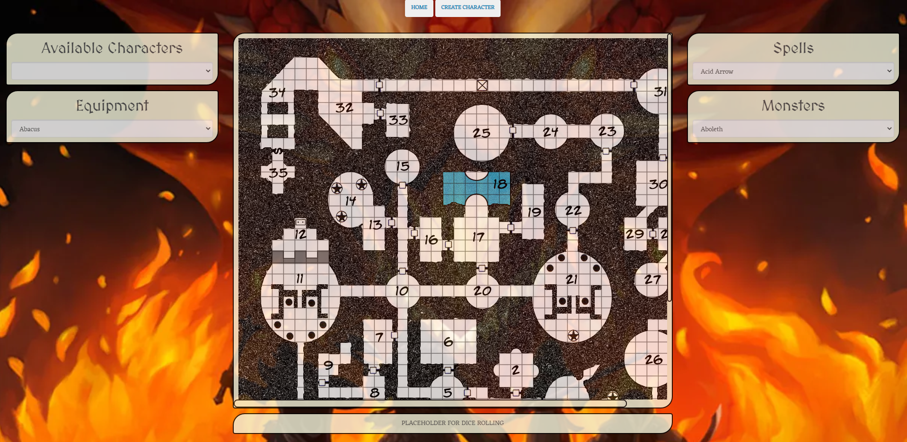

# Chummy Cats Project 2: Dungeons and Dragons Helper App
  
  
  
  
  [Deployed on Heroku](https://blooming-ridge-74846.herokuapp.com/)
  
  ## Description
An app that allows players to engage in a match of Dungeons and Dragon. You can create a character with classification of the characters race, class, and alignment. This App also lets you view different types of equipment, cast spells, look up knowledge of different DND monsters and generate maps to play on. 

  ## Table of Contents

  * [Installation](#installation)
  * [Usage](#usage)
  * [Tech-Used](#Tech-Used)
  * [License](#license)
  * [Repository](#Repository)
  * [Questions](#questions)

  ## Installation

Clone this repository into your local storage. Once this is complete, please follow these steps;

1)Create a mysql db called "dandd_db" 2)Open terminal in current repo and run "npm i" to install all node packages 3)While in terminal, run "node server.js" and you will successfully connect to server 4)Open browser and put "http://localhost:8080" in search bar 5)Enjoy using the app!

  ## Usage
  
 Sign in or create a new accout. From there you can create a character, or use the dashboard to look up spells, monsters, weapons, etc. There is also a dice roller that allows for the common sizes of dice. Each pane is moveable, so you can rearrange your dashboard so it works with your workflow.

  ## App Screen Shots

     
  
  

  ## Tech Used
  
  Express, Handlebars, bcrypt, MySQL, passport, DND 5e API

  ## License

  

  ## Repository

  - [Github](https://github.com/tsgrewing/project-2)
  - [Heroku](https://blooming-ridge-74846.herokuapp.com/)

  ## Questions

  If you have any additional questions you may contact us at:

   * https://github.com/tsgrewing
   * https://github.com/EMackPierre
   * https://github.com/BillyJHicksJr

  
